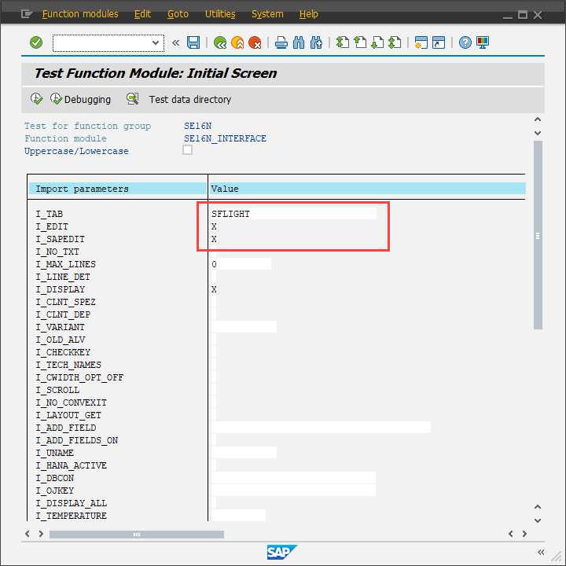
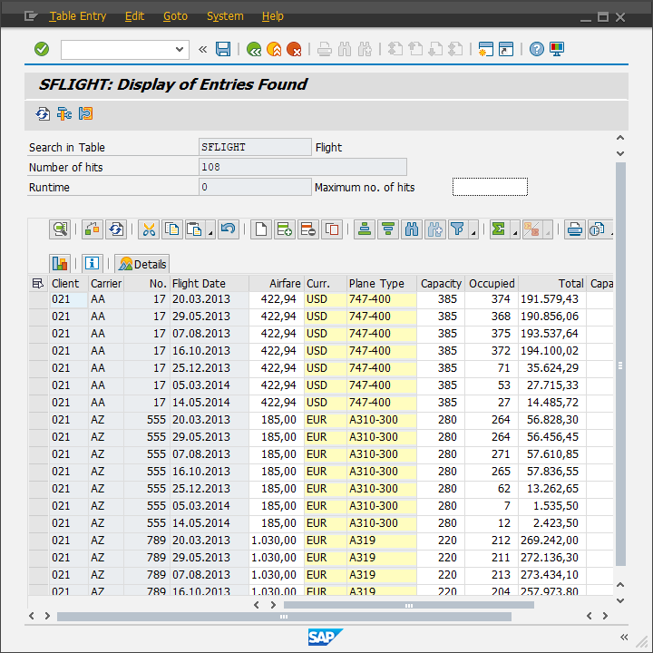
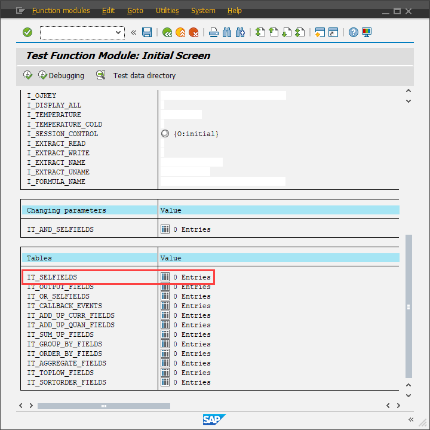
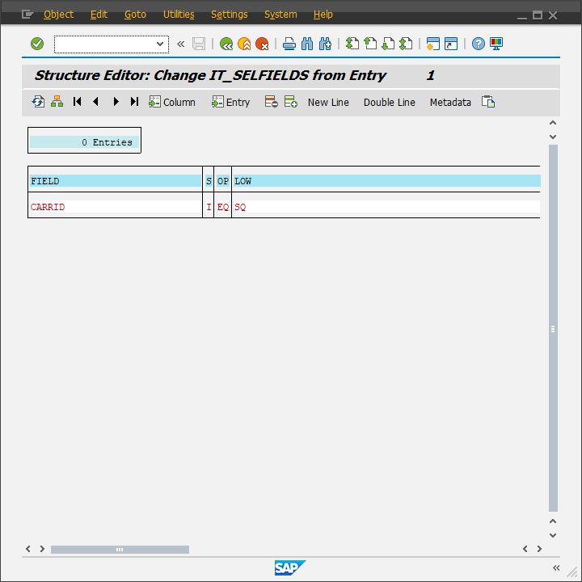
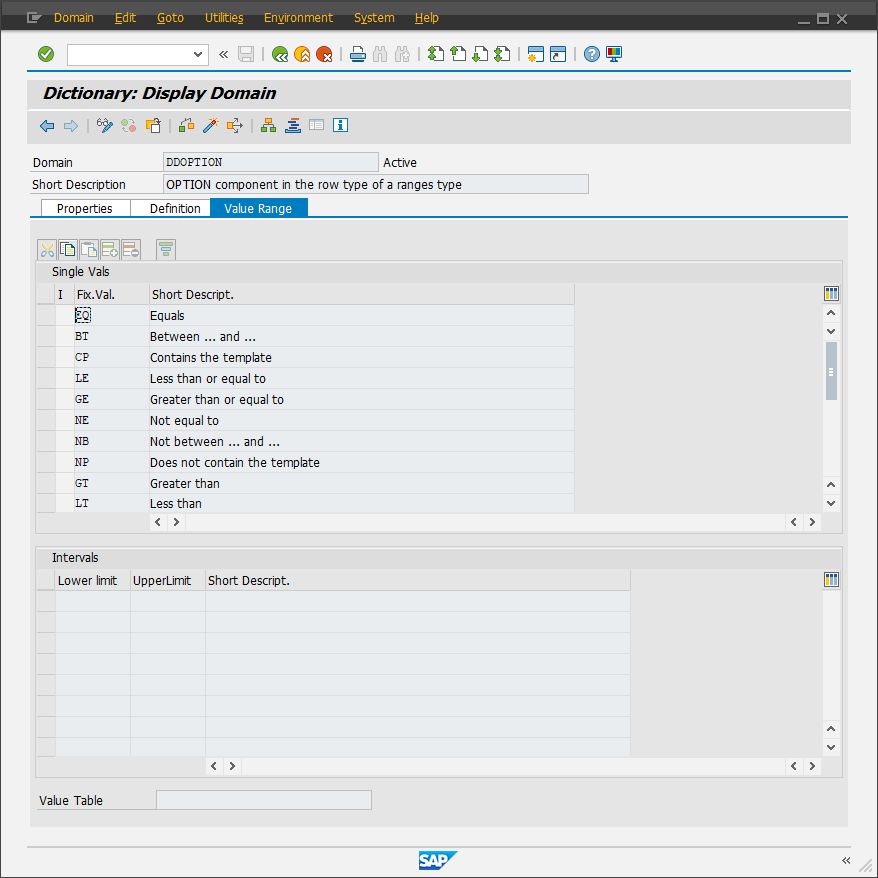
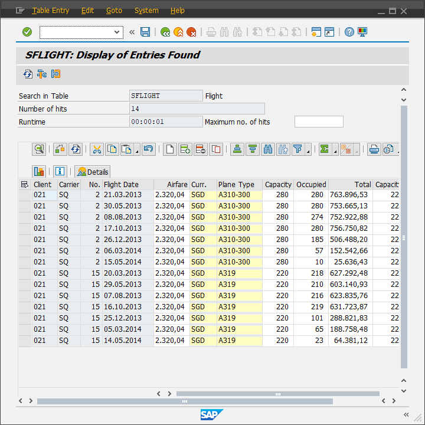

# Editable SE16N

For some reason you ever needed to edit some value of a table but you didn't have debug permission?

If you're lucky and have permission to execute Function Modules you're good!

Go to SE37 and run this FM: SE16N_INTERFACE. Once you're there you just need to fill in these first 3 fields:

The result is a SE16N view but with edit permission.
_Of course you can't edit the value of Key fields but you can copy the hole line, delete it and create a new one_

You can also filter using the table below. If you know how to fill a Range using ABAP this will be easy and usefull, but if you don't it'll probably be tricky.

I filled the fields below like I would fill a Range on ABAP. Once you fill, just press F3 or click on the green Back button and you'll see that you have one entry in your table.

If you are not familiar with the Range Types you can check the next image.

This is the result using filters:

